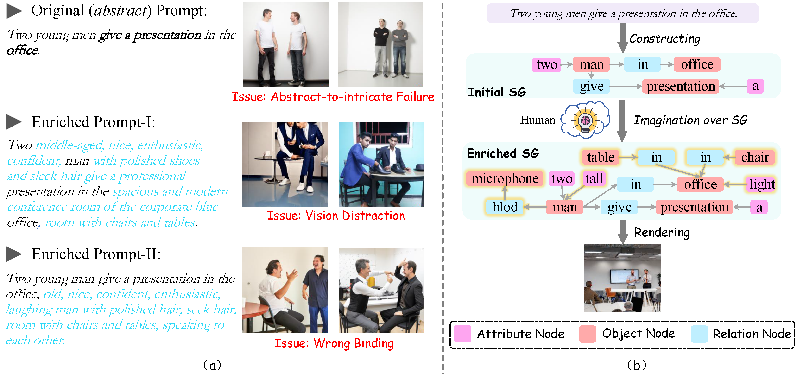
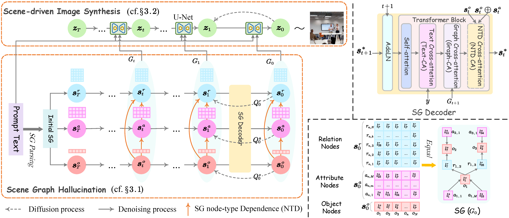

<h2 align="center">
Imagine That! Abstract-to-Intricate Text-to-Image Synthesis with Scene Graph Hallucination Diffusion 🔥
</h2>

<div align="center">

[](https://proceedings.neurips.cc/paper_files/paper/2023/file/fa64505ebdc94531087bc81251ce2376-Paper-Conference.pdf)
[](https://github.com/ChocoWu/T2I-Salad) 
</div>


## Overview 
In this work, we investigate the task of text-to-image (T2I) synthesis under the
abstract-to-intricate setting, i.e., generating intricate visual content from simple abstract text prompts. Inspired by human imagination intuition, we propose a novel scene-graph hallucination (SGH) mechanism for effective abstract-to-intricate T2I synthesis. SGH carries out scene hallucination by expanding the initial scene graph (SG) of the input prompt with more feasible specific scene structures, in which the structured semantic representation of SG ensures high controllability of the intrinsic scene imagination. To approach the T2I synthesis, we deliberately build an SG-based hallucination diffusion system. First, we implement the SGH module based on the discrete diffusion technique, which evolves the SG structure by iteratively adding new scene elements. Then, we utilize another continuous-state diffusion model as the T2I synthesizer, where the overt image-generating process is navigated by the underlying semantic scene structure induced from the SGH module. On the benchmark COCO dataset, our system outperforms the existing best-performing T2I model by a significant margin, especially improving on the abstract-to-intricate T2I generation.

<!-- <p align="center">
    < </center>
</p> -->

 

## Method
We develop an SG-based hallucination diffusion system (namely, Salad) for high-quality image synthesis. Salad is a fully diffusion-based T2I system, which mainly consists of a scene-driven T2I module and an SGH module. As shown in the following figure, we first take advantage of the SoTA latent diffusion model as our backbone T2I synthesizer, in which the overt image-generating process is controlled and navigated by the underlying semantic scene structure.

<!-- <p align="center">
    < </center>
</p> -->
 


## Installation
- Main packages: PyTorch = 2.1.1 
- See `requirements.txt` for other packages.

## Data Preparation
We use [COCO](https://cocodataset.org/) and [Visual Genome(VG)](https://homes.cs.washington.edu/~ranjay/visualgenome/about.html) for training the model.

## Run

Simply run `main.py` to traing the model.


## Citation
```
@inproceedings{Wu0ZC23,
  author       = {Shengqiong Wu and
                  Hao Fei and
                  Hanwang Zhang and
                  Tat{-}Seng Chua},
  title        = {Imagine That! Abstract-to-Intricate Text-to-Image Synthesis with Scene Graph Hallucination Diffusion},
  booktitle    = {Proceeding of NeurIPS},
  year         = {2023}
}
```

## Acknowledgement

Our code is based on the respective official repositories, [GLIGEN](https://github.com/gligen/GLIGEN), [LayoutDM](https://github.com/CyberAgentAILab/layout-dm), and [VQ-Diffusion](https://github.com/microsoft/VQ-Diffusion/). We fully thank the authors to release their code.
